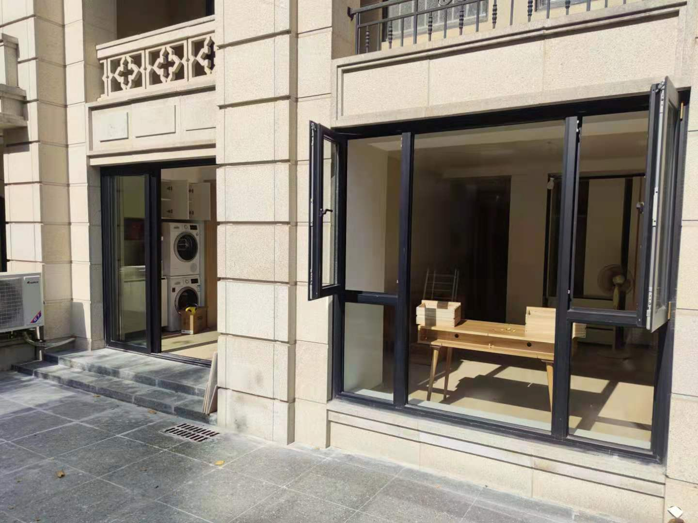
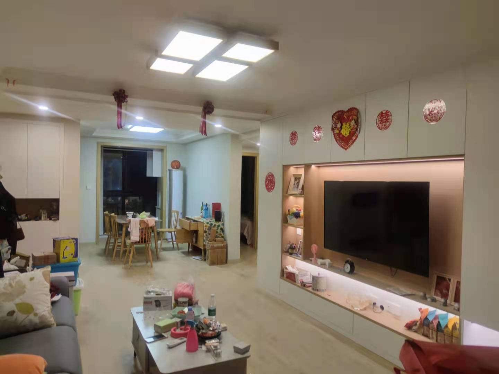
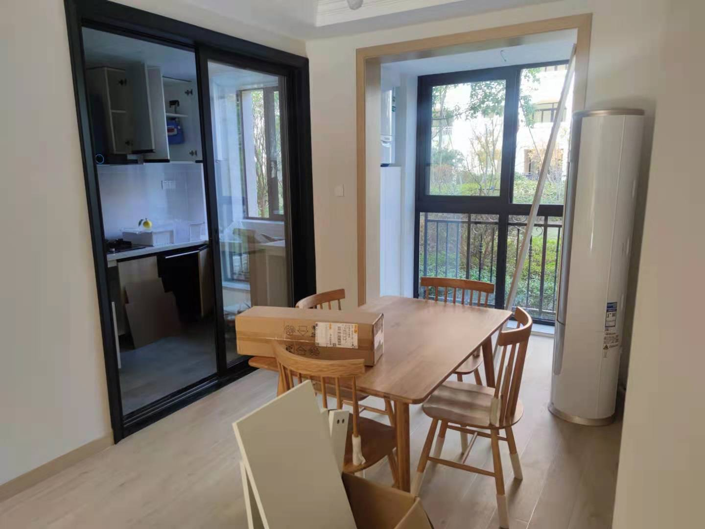
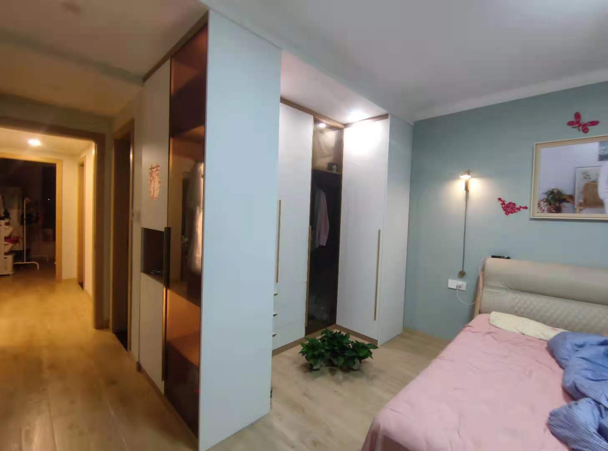
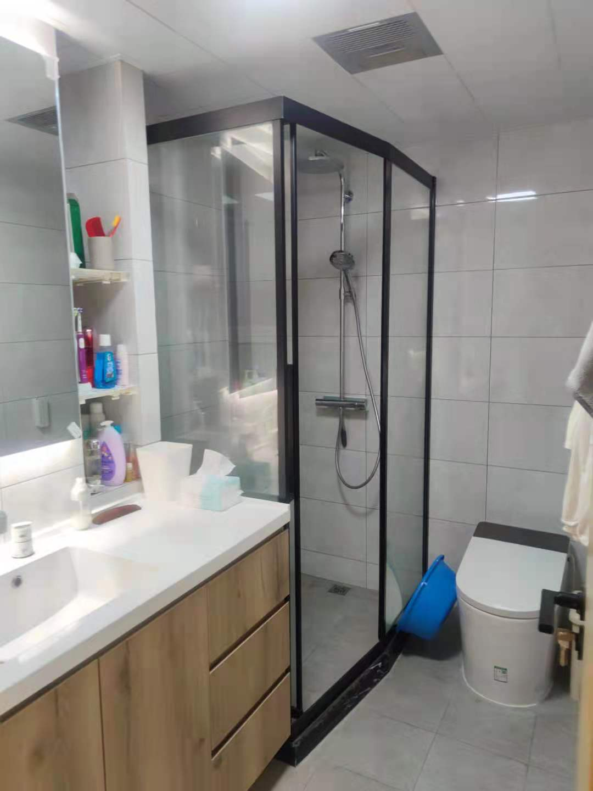

# 2020我的装修经验总结

## 为什么要写这篇文档
1. 很多同事要装修了，小朋友你是否有很多问号
2. 记录下生活
3. 秀  : )
## 目录
  - [一、装修milestone](#%E4%B8%80%E8%A3%85%E4%BF%AEmilestone)
  - [二、装修公司选择](#%E4%BA%8C%E8%A3%85%E4%BF%AE%E5%85%AC%E5%8F%B8%E9%80%89%E6%8B%A9)
  - [三、监理公司选择](#%E4%B8%89%E7%9B%91%E7%90%86%E5%85%AC%E5%8F%B8%E9%80%89%E6%8B%A9)
  - [四、装修前设计过程（图纸确认）](#%E5%9B%9B%E8%A3%85%E4%BF%AE%E5%89%8D%E8%AE%BE%E8%AE%A1%E8%BF%87%E7%A8%8B%E5%9B%BE%E7%BA%B8%E7%A1%AE%E8%AE%A4)
  - [五、好的开始是成功的一半](#%E4%BA%94%E5%A5%BD%E7%9A%84%E5%BC%80%E5%A7%8B%E6%98%AF%E6%88%90%E5%8A%9F%E7%9A%84%E4%B8%80%E5%8D%8A)
  - [六、装修具体进程](#%E5%85%AD%E8%A3%85%E4%BF%AE%E5%85%B7%E4%BD%93%E8%BF%9B%E7%A8%8B)
  - [七、装修花费](#%E4%B8%83%E8%A3%85%E4%BF%AE%E8%8A%B1%E8%B4%B9)
  - [八、我家美图](#%E5%85%AB%E6%88%91%E5%AE%B6%E7%BE%8E%E5%9B%BE)
  - [九、心得](#%E4%B9%9D%E5%BF%83%E5%BE%97)
## 一、装修milestone
 + 2019年10月下旬 - 认筹摇号购入
 + 2021年年初开始 - 对比装修公司报价 
 + 2020年05月中旬 - 交房
 + 2020年05月23日 - 开工大吉 & 监理开工交底
 + 2020年06月01日 - 监理水电定位
 + 2020年06月17日 - 水电验收
 + 2020年06月19日 - 吊顶龙骨验收
 + 2020年06月22日 - 吊顶石膏板验收
 + 2020年06月24日 - 地暖管铺设验收
 + 2020年06月27日 - 瓷砖铺设初期验收
 + 2020年07月09日 - 瓷砖铺设完成验收
 + 2020年07月20日 - 油漆前基础验收
 + 2020年08月14日 - 油漆上门验收
 + 2020年08到11月 - 橱柜、衣柜、木门、家具、家电等进场
 + 2020年11月29日 - 竣工验收

## 二、装修公司选择
首先，装修类型可以分为半包:自己包主材，装修队包人工、辅材(推荐，我们是这个);清包:自己找工程队、包所有材料(过于浪费精力); 全包:装修公司全包所有内容(担心主材质量)。

装修公司的选择我们其实有两个大方向： 
+  找网上好评多的连锁装修公司 
+  找小区施工经验丰富的小装修公司

前者我们对比了 同济装修设计、上海本地的几个装修连锁店。聊的环节上基本都是上门量房、询问业主自己装修想法、出平面设计图，简单效果图、预估报价单。然后就会催你交定金或者设计费，然后才会继续往深入探讨。前面的环节都是免费的，我们可以多找几家同时来出方案和报价。不过，这些装修公司的报价会偏高一点，质量也应该不会出什么大问题。装修时可以多找几个这样的装修公司，白嫖几套平面方案，既可以让自己对自己房子有一个明确的设计方向，也可以对装修花费有一个对比参考。

后者我们对比了 缔赛装修设计、明月装饰等几个。这些装修公司的优势就是对小区熟，跟物业熟，对房型熟，整体装修进程上把控力会更高一点。但是缺点也同样明显，他们的工人人力是有限的，一般都是老家50岁左右的退休工人，当同时装修的多了就会外面随便找工人之类的，施工质量要自己把好关。最终，我们选择了缔赛装修设计，原因是他们家本小区去年有两个同户型装修案例，装修效果和业主反馈都还可以，而且他们愿意给我们同户型的CAD设计图，3D效果图等源文件，让我们可以自己提前思考下屋内的区域设计。

对比了很多家装修公司，其实套路都是一样的：先量房，CAD出个简单平面设计图，酷家乐出个3D效果图，然后拿Excel报价单模板一套，就会催你review交钱了。在套路都一致的情况下，你要选择的其实是通过几次面对面交流，能让你觉得靠谱、实在的那一家装修公司。因为跟你聊的其实也是销售，要更多的了解后面的装修队人员情况，公司情况等等。

另外，最好找能合同里写明无增项的装修公司，水电也不要按实计算，明明都是设计阶段就可以算出实际使用多少的，没有必要有按实际计费的项目。给一份我们的报价单作为参考, [./装修报价单](./装修报价单/)。

## 三、监理公司选择
非专业装修的，一定要选监理！一定要选监理！一定要选监理！ 根据自己的了解，找最靠谱的第三方监理平台就可以了，我找的是搭窝，上面的milestone时间节点全靠监理的报告才知道的。 一般监理上门10次就够了，买多了也有点浪费。附上我的所有监理报告，给大家参考下[./监理验收报告](./监理验收报告/)。

## 四、装修前设计过程（图纸确认）
装修前一定要明确一点： 装修不是找到一个装修公司，让他给你装就完了；而是通过装修公司，让你知道自己想要的到底是什么。最终房子住的是你自己，所以设计时一定要自己好好的想，自己的需求到底是什么，事无巨细的想！ 尽可能多的面对面或者远程共享屏幕的去review设计师的设计图：家具家电的位置，插座开关的位置，洗手台淋浴马桶的位置，阳台的空间安排等等。一定要自己想好确认，多给设计师提意见！

最后所有的图纸要确认后再装修，一定要仔细确认，不然图纸最后要改带来的增项费用只能自己承担。
我的前期设计方案图纸放在  [./装修设计平面图](./装修平面设计图) 内了，可以参考下。

## 五、好的开始是成功的一半

好的开始是成功的一半，剩下的一半就是你和监理一步步仔细验收的过程了。 其实装修说复杂也复杂，说简单也简单，一但开始了，也就标志的半年后就结束了。不要想得很难，只要一步步的仔细验收，遇到困难放平心态，积极的协调推进解决，都会顺利过去的！

## 六、装修具体进程
装修的大进程其实看上面的milestone就可以了，但其实每个过程里还有一些细节的工作，我在这里罗列一下，以供参考， 家博会多逛逛，活动价格还可以。

| 阶段 |  阶段前需完成内容 & 注意事项 | 阶段后需准备内容  |
| --- | ---| --- |
| 确定装修设计方案 | 与家人详细沟通功能需求、确认图纸、明确效果图 | 对应主材购买、监理上门排期 |
| 拆旧、砸墙 | 确定好承重墙位置， 尽量一个工作日砸完 | 水电施工进场日期确定、门窗更换尽量早 |
| 水电施工 | 监理水电交底，灯具、开关、插座、冷热水、上下水、热水器、地暖中央空调新风厂商等点位确认 | 橱柜量房设计、地暖、中央空调铺设进场准备 |
| 水电完成 | 地暖中央空调新风等确认无误 | 自己再次确认插座开关等是否足够，该加就加，多多益善 |
| 吊顶施工 | 中央空调新风管路铺设，新风打孔15cm | 全屋瓷砖备好送货日期 |
| 地暖施工 | 地暖线路控制设计 | 地面找平方便贴砖 |
| 瓷砖铺贴 | 全屋防水及闭水试验、瓷砖已经买好、确定厨卫瓷砖对缝，墙缝对地缝 | 瓷砖保护贴纸，防止油漆弄脏； 购买乳胶漆送货； 瓷砖美缝； 厨卫吊顶 |
| 油漆施工 | 铲除老腻子，挂网，阴阳角保护 | 腻子、乳胶漆晾干通风， 准备全屋定制柜子， 木门定制、淋浴房移门定制 这些定制起码都得一个月的制作周期，所以提前定最好 |
| 瓷砖美缝 | 1-2天的工作量，没啥特别注意的 |
| 橱柜施工 | 橱柜的功能性自己想好，抽屉、拉篮、厨房电器位置等，记得水槽和灶台间留好案板的位置。板材尽量也是选环保的吧，主要还是看封边，封边封的好就味道小，不然味道都很大。我家是小厂的全上海文信爱格板。价单和设计图也放出来供大家参考了。 [./橱柜设计&报价](./橱柜设计&报价) | 
| 厨卫吊顶 | 一天就能装好，现在暖风机都是遥控的，大部分不需要留开关了
| 全屋定制 | 这块花费会比较大，坑也很多，b站搜 迷瞪，看看讲解视频吧，我们家门板都用了上海文信的爱格板，柜体为了省钱用了装修公司上海工厂的板，注意封边应该都还好。 设计上最好也是自己能给给意见，多看看酷家乐的图，结合自己家好好想想，自己设计的才是最喜欢的。同样给出我家的设计和报价。[./全屋定制设计&报价](./全屋定制设计&报价) 
| 家装小物件 | 燃气表、水槽、烟机灶具、浴室柜、花洒、马桶等等
| 木门安装 | 木门市场上差价也比较大， TATA木门一个2-3000多，其他的便宜点，尽量选实木>实木拼接，看个人预算了。我觉得我家木门的味道还是比较大的
| 门套踢脚线，地板 | 一般木门和这些是一起卖的，颜色也可以选统一的，预估一个多月的制作周期买好就可以了
| 家电家具 | 这些就见人见智了，推荐些一定要买的， 13套+的洗碗机！ 洗衣机+烘干机！厨房垃圾处理器！ 云鲸拖地机器人！300L+的冰箱！预算够就上日本电子品牌的，不够国产也一样。日本房间小，电器的空间利用率稍微高一点，占地面积小了也是变相省钱了。

## 七、装修花费
+ 位置：上海浦东唐镇王港某小区一楼，两房两卫+小院
+ 面积：产证108，室内装修88平，院子30平
+ 装修类型： 半包

 | 项目  | 花费 | 区域 |
 | --- | ---| --- |
 | -----------------硬装------------------ | ---| --- | 
 |装修设计 | 2000 |  -
 |监理上门11次 | 1500 |  -
 |物业垃圾清运 | 3000 |  -
 |物业垃圾短驳 | 1500 | -  
 |敲墙 | 2200 | -
 |墙体打洞 | 540+180 | -
 |伟昌双层玻璃窗户 | 15000 | -
 |施耐德空气开关 | 767 | -
 |西门子开关插座 | 1500 | -
 |立邦油漆 | 3300 | -
 |木纹砖 阿里巴巴佛山工厂店 | 8055 | -
 |厨卫阳台墙砖地砖 | 2560 | 厨卫
 |院子瓷砖 + 补砖 | 1944 + 360 | 院子
 |全屋瓷砖美缝 环氧彩砂 | 8200 | -
 |厨卫吊顶 武峰吊顶 | 3250 | 厨卫
 |浴霸两套松下暖风机 | 1500 | 卫浴
 |智能马桶x2| 3600 + 3000| 卫浴
 |恒温花洒x2 汉斯格雅+恒洁| 2700 + 950| 卫浴
 |浴室柜x2| 5422定制 + 1500 + 150安装| 卫浴
 |浴室镜x1| 600 | 卫浴
 |绿叶淋浴房+厨房移门| 11800| 厨卫
 |厨房橱柜+台面 - 文信爱格板| 16540| 厨房
 |欧琳水槽 + 抽拉龙头 + 院子华帝水槽 | 1300 + 470 + 270 | 厨房
 |地暖（热水器） 德国威能冷凝炉套餐 | 29000 | 厨卫
 |全屋定制 电视墙柜、阳台柜、衣柜| 49000| -
 |窗台大理石、门槛石等石材 | 3217 | -
 |卧室厕所木门配磁吸锁 | 6000 | -
 |实木门套踢脚线 | 3500 | -
 |所有灯具 | 500筒灯+ 322壁灯 + 3000主灯 | -
 |半包装修一、二、三期费用 | 81000 | -
 |半包增项，院子砌台阶、水池、全屋地暖找平、阳台封顶、包下水管 | 15000 | -
 |------------------软装家电家具---------------- | --- | 
 |床垫x2 喜临门基本款 | 2200 x2 | 卧室
 |白橡木家具 餐桌椅、两张床、餐边柜、写字梳妆台 | 12000 | 卧室餐厅
 |三个格力壁挂空调 | 8800 | 卧室餐厅
 |科龙柜机空调 | 3500 | 客厅
 |小米电视+支架 | 2470 | 客厅
 |云鲸拖地机器人 | 3700 | 客厅
 |芝华士沙发 | 5500 | 客厅
 |小茶几 | 900 | 客厅
 |AP路由器+3AP面板 | 1300 | 客厅
 |华帝抽油烟机灶具 | 4000 | 厨房
 |西门子636洗碗机 | 5899 | 厨房
 |厨房垃圾处理器 | 2200 | 厨房
 |奥马冰箱 | 1500 | 厨房
 |小米电动晾衣杆 | 688 | 阳台
 |博世洗衣机、烘干机 &配件安装 | 10500 | 阳台
 |工作写字台 | 复用 | 阳台
 |网易人体工学椅 | 700 | 阳台
 |所有窗帘 | 3300 | -
 |---------- | --- | -
 合计 | 367554| -

~
## 八、我家美图
我家选择了日系原木风的装修风格，尽量最大化利用家里的空间，显得big一点。

我家客厅

主卧

主卧大衣柜

主卫

## 九、心得
有空再写喽。。。